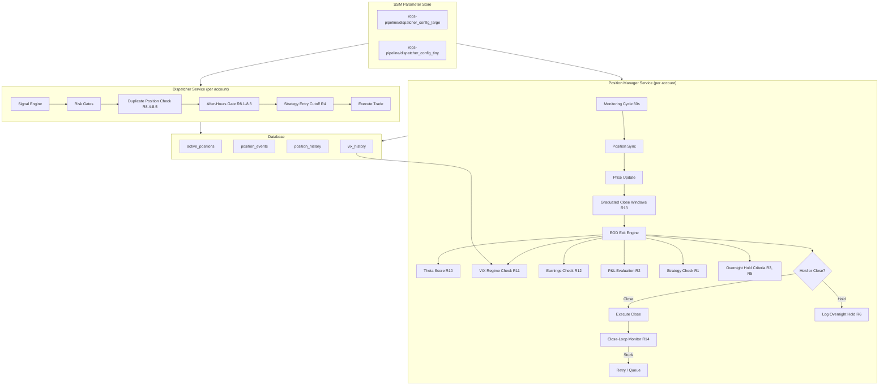
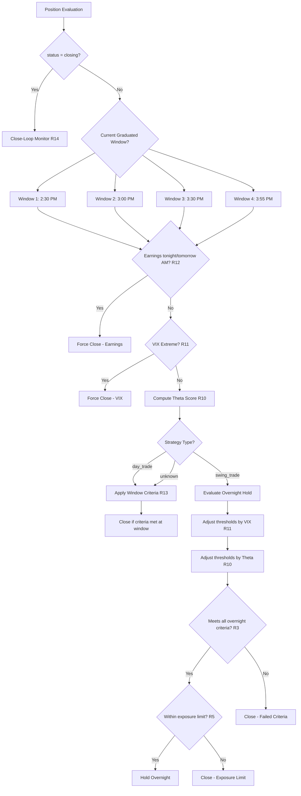

# Design Document: EOD Trading Strategy

## Overview

This design covers the complete end-of-day (EOD) exit strategy for an algorithmic options trading system running on AWS ECS Fargate with 2 Alpaca paper trading accounts. The system replaces a blanket 3:55 PM force-close with a strategy-aware, P&L-aware, configurable exit engine that factors in theta decay, VIX regime, earnings calendar, graduated timing windows, and position close-loop integrity.

The design spans 14 requirements (R1-R14) across two primary services:
- **Position Manager** (`services/position_manager/`) — exit logic, overnight hold evaluation, close execution
- **Dispatcher** (`services/dispatcher/`) — entry gates, after-hours prevention, duplicate blocking

All configuration is SSM-driven (JSON in Parameter Store), all decisions are logged to `position_events` for the AI learning pipeline, and account-specific behavior is supported via tier-specific SSM parameters.

## Architecture



### Decision Flow Per Position



## Components and Interfaces

### 1. EOD Exit Engine (`services/position_manager/eod_engine.py`) — NEW

Central orchestrator for all EOD decisions. Replaces the current `market_close_protection` block in `check_time_based_exits()`.

```python
class EODExitEngine:
    """
    Evaluates end-of-day exit decisions for all open positions.
    Implements graduated close windows, theta scoring, VIX adjustment,
    earnings calendar checks, and overnight hold criteria.
    """
    
    def __init__(self, config: EODConfig, account_tier: str):
        self.config = config
        self.account_tier = account_tier
        self.earnings_cache: Dict[str, Optional[EarningsInfo]] = {}
        self.vix_regime: Optional[VIXRegime] = None
    
    def evaluate_position(self, position: Dict, current_window: int) -> EODDecision:
        """
        Evaluate a single position at the current graduated window.
        Returns an EODDecision (hold, close, or skip).
        """
        ...
    
    def compute_theta_score(self, position: Dict) -> float:
        """
        Compute theta score = abs(theta) / current_premium.
        Falls back to max risk (1.0) if theta unavailable.
        """
        ...
    
    def get_vix_regime(self, db_conn) -> VIXRegime:
        """
        Query latest VIX regime from vix_history.
        Cache for the monitoring cycle. Fallback to 'elevated' if stale.
        """
        ...
    
    def check_earnings(self, ticker: str) -> Optional[EarningsInfo]:
        """
        Check if ticker has earnings within 1 trading day.
        Caches results per trading day.
        """
        ...
    
    def compute_close_urgency(self, position: Dict, theta_score: float, 
                               minutes_to_close: float) -> float:
        """
        Composite urgency score for prioritizing closes.
        Higher = more urgent to close.
        """
        ...
    
    def apply_vix_adjustments(self, base_criteria: OvernightCriteria) -> OvernightCriteria:
        """
        Adjust overnight hold thresholds based on VIX regime.
        """
        ...
    
    def apply_theta_adjustments(self, criteria: OvernightCriteria, 
                                 theta_score: float) -> OvernightCriteria:
        """
        Lower P&L threshold when theta burn is high.
        Force-close if DTE <= 2 and high theta.
        """
        ...
```

### 2. EOD Config (`services/position_manager/eod_config.py`) — NEW

Loads and validates all EOD-related SSM parameters.

```python
@dataclass
class EODConfig:
    # Existing R1-R9
    day_trade_close_time: time  # Replaced by graduated windows
    min_dte_for_overnight: int = 3
    min_pnl_pct_for_overnight: float = 10.0
    max_position_pct_for_overnight: float = 5.0
    max_overnight_option_exposure: float = 5000.0
    profit_delay_threshold_pct: float = 20.0
    profit_delay_minutes: int = 10
    
    # R10: Theta
    high_theta_threshold: float = 0.05
    theta_pnl_penalty_pct: float = 10.0
    
    # R11: VIX
    vix_elevated_multiplier: float = 1.5
    vix_high_multiplier: float = 2.0
    
    # R13: Graduated windows
    graduated_close_windows: List[str] = field(
        default_factory=lambda: ["14:30", "15:00", "15:30", "15:55"]
    )
    window_1_max_loss_pct: float = -20.0
    window_2_max_loss_pct: float = -10.0
    
    # R14: Close-loop
    max_closing_duration_minutes: int = 5
    max_positions_per_ticker: int = 3
    
    @classmethod
    def from_ssm(cls, ssm_params: Dict) -> 'EODConfig':
        """Parse from SSM JSON with defaults for missing/invalid values."""
        ...
    
    def to_dict(self) -> Dict:
        """Serialize to dict for JSON storage."""
        ...
    
    @classmethod
    def from_dict(cls, data: Dict) -> 'EODConfig':
        """Deserialize from dict."""
        ...
```

### 3. Earnings Calendar Client (`services/position_manager/earnings_client.py`) — NEW

Fetches earnings dates from Alpaca corporate actions API.

```python
class EarningsCalendarClient:
    """
    Checks upcoming earnings announcements for tickers.
    Caches results per trading day to minimize API calls.
    """
    
    def __init__(self, api_key: str, api_secret: str):
        self.api_key = api_key
        self.api_secret = api_secret
        self._cache: Dict[str, Optional[EarningsInfo]] = {}
        self._cache_date: Optional[date] = None
    
    def has_upcoming_earnings(self, ticker: str) -> Optional[EarningsInfo]:
        """
        Check if ticker has earnings within 1 trading day.
        Returns EarningsInfo with date and timing, or None.
        """
        ...
    
    def _fetch_corporate_actions(self, ticker: str) -> Optional[EarningsInfo]:
        """
        Query Alpaca /v1/corporate-actions endpoint for earnings.
        Fallback: query a free earnings calendar API if Alpaca unavailable.
        """
        ...
    
    def invalidate_cache(self):
        """Clear cache (called at start of each trading day)."""
        self._cache.clear()
        self._cache_date = None

@dataclass
class EarningsInfo:
    ticker: str
    earnings_date: date
    timing: str  # 'after_close' or 'before_open'
```

### 4. Close-Loop Monitor (`services/position_manager/close_loop.py`) — NEW

Detects and recovers from stuck closing attempts.

```python
class CloseLoopMonitor:
    """
    Monitors positions in 'closing' state and handles recovery.
    Prevents duplicate close attempts and queues closes for market open.
    """
    
    def __init__(self, config: EODConfig):
        self.config = config
    
    def check_stuck_positions(self, positions: List[Dict]) -> List[CloseAction]:
        """
        Find positions stuck in 'closing' state beyond max_closing_duration_minutes.
        Returns list of recovery actions (retry or queue).
        """
        ...
    
    def is_market_open(self) -> bool:
        """Check if market is currently open (9:30 AM - 4:00 PM ET)."""
        ...
    
    def detect_duplicates(self, positions: List[Dict]) -> List[Dict]:
        """
        Find duplicate positions (same ticker, account, instrument_type).
        Returns positions to close (all but most recent).
        """
        ...
```

### 5. Graduated Window Evaluator (within EOD Exit Engine)

```python
@dataclass
class GraduatedWindowCriteria:
    """Criteria that apply at each graduated close window."""
    window_time: time
    window_index: int  # 0-based
    
    def evaluate_day_trade(self, position: Dict, config: EODConfig) -> Optional[str]:
        """
        Apply window-specific criteria for day trades.
        Returns close reason or None if position should stay open.
        
        Window 0 (2:30): Close if loss > window_1_max_loss_pct
        Window 1 (3:00): Close if loss > window_2_max_loss_pct, 
                          or swing failing >1 criterion
        Window 2 (3:30): Close if any loss (day), 
                          or swing failing any criterion
        Window 3 (3:55): Close all remaining day trades,
                          close swings not meeting ALL criteria
        """
        ...
    
    def evaluate_swing_trade(self, position: Dict, config: EODConfig,
                              overnight_criteria: OvernightCriteria) -> Optional[str]:
        """Apply window-specific criteria for swing trades."""
        ...
```

### 6. Modified Dispatcher Duplicate Gate (`services/dispatcher/risk/gates.py`) — MODIFIED

```python
def check_duplicate_position(
    ticker: str,
    instrument_type: str,
    account_name: str,
    open_positions: List[Dict]
) -> GateResult:
    """
    R8.4-8.5: Block signals for tickers that already have an open or closing position
    in the same account with the same instrument type.
    """
    for pos in open_positions:
        if (pos['ticker'] == ticker and 
            pos['instrument_type'] == instrument_type and
            pos['account_name'] == account_name and
            pos['status'] in ('open', 'closing')):
            return (False, f"duplicate_position_blocked: {ticker} {instrument_type} already {pos['status']}", 
                    ticker, None)
    return (True, f"No duplicate position for {ticker} {instrument_type}", ticker, None)
```

### 7. Modified Entry Cutoff Gate — MODIFIED

```python
def check_trading_hours_v2(
    recommendation: Dict[str, Any],
    config: Dict[str, Any]
) -> GateResult:
    """
    R4 + R8: Strategy-aware entry cutoffs with after-hours blocking.
    """
    strategy = (recommendation.get('strategy_type') or '').lower()
    
    # R8: Hard block outside market hours
    # ... existing market hours check ...
    
    # R4: Strategy-specific cutoffs
    if strategy == 'swing_trade':
        cutoff = config.get('last_entry_hour_et_swing_trade', 15)
    else:
        cutoff = config.get('last_entry_hour_et_day_trade', 14)
    
    # ... cutoff evaluation ...
```

## Data Models

### EODDecision

```python
@dataclass
class EODDecision:
    position_id: int
    ticker: str
    strategy_type: str
    decision: str  # 'hold', 'close', 'skip'
    close_reason: Optional[str] = None  # e.g., 'earnings_close', 'theta_force_close', 'graduated_window_2'
    pnl_pct: float = 0.0
    pnl_dollars: float = 0.0
    dte: Optional[int] = None
    theta_score: Optional[float] = None
    vix_regime: Optional[str] = None
    window_index: Optional[int] = None
    close_urgency_score: Optional[float] = None
    criteria_results: Dict[str, CriterionResult] = field(default_factory=dict)
    earnings_info: Optional[EarningsInfo] = None
    account_tier: str = 'large'
    
    def to_event_payload(self) -> Dict:
        """Serialize to JSON for position_events logging (R6)."""
        return {
            'position_id': self.position_id,
            'strategy_type': self.strategy_type,
            'decision': self.decision,
            'close_reason': self.close_reason,
            'pnl_pct': self.pnl_pct,
            'pnl_dollars': self.pnl_dollars,
            'dte': self.dte,
            'theta_score': self.theta_score,
            'vix_regime': self.vix_regime,
            'window_index': self.window_index,
            'close_urgency_score': self.close_urgency_score,
            'criteria': {k: v.to_dict() for k, v in self.criteria_results.items()},
            'earnings': self.earnings_info.__dict__ if self.earnings_info else None,
            'account_tier': self.account_tier,
        }
```

### CriterionResult

```python
@dataclass
class CriterionResult:
    name: str           # e.g., 'min_dte', 'min_pnl_pct', 'max_position_pct', 'theta', 'vix'
    observed: float     # actual value
    threshold: float    # required value (after VIX/theta adjustments)
    passed: bool
    adjusted_by: Optional[str] = None  # 'vix_elevated', 'theta_penalty', etc.
    
    def to_dict(self) -> Dict:
        return {
            'name': self.name,
            'observed': self.observed,
            'threshold': self.threshold,
            'passed': self.passed,
            'adjusted_by': self.adjusted_by,
        }
```

### VIXRegime

```python
@dataclass
class VIXRegime:
    vix_value: float
    regime: str  # 'complacent', 'normal', 'elevated', 'high', 'extreme'
    recorded_at: datetime
    
    @property
    def is_stale(self) -> bool:
        """True if data is older than 24 hours."""
        return (datetime.now(timezone.utc) - self.recorded_at).total_seconds() > 86400
    
    @property
    def effective_regime(self) -> str:
        """Returns 'elevated' if stale, otherwise actual regime."""
        return 'elevated' if self.is_stale else self.regime
```

### OvernightCriteria

```python
@dataclass
class OvernightCriteria:
    """Overnight hold thresholds — may be adjusted by VIX and theta."""
    min_dte: int = 3
    min_pnl_pct: float = 10.0
    max_position_pct: float = 5.0
    max_overnight_exposure: float = 5000.0
    
    def evaluate(self, position: Dict, account_equity: float, 
                 total_overnight_notional: float) -> Dict[str, CriterionResult]:
        """Evaluate position against all criteria. Returns dict of results."""
        results = {}
        
        # DTE check
        dte = position.get('dte', 0)
        results['min_dte'] = CriterionResult('min_dte', dte, self.min_dte, dte >= self.min_dte)
        
        # P&L check
        pnl_pct = float(position.get('current_pnl_percent', 0))
        results['min_pnl_pct'] = CriterionResult('min_pnl_pct', pnl_pct, self.min_pnl_pct, 
                                                   pnl_pct >= self.min_pnl_pct)
        
        # Position size check
        notional = float(position.get('notional', 0))
        position_pct = (notional / account_equity * 100) if account_equity > 0 else 100.0
        results['max_position_pct'] = CriterionResult('max_position_pct', position_pct, 
                                                        self.max_position_pct,
                                                        position_pct <= self.max_position_pct)
        
        return results
```

### SSM Config Schema (JSON in Parameter Store)

The following keys are added to the existing `/ops-pipeline/dispatcher_config_{tier}` SSM parameters:

```json
{
  "high_theta_threshold": 0.05,
  "theta_pnl_penalty_pct": 10.0,
  "vix_elevated_multiplier": 1.5,
  "vix_high_multiplier": 2.0,
  "graduated_close_windows": ["14:30", "15:00", "15:30", "15:55"],
  "window_1_max_loss_pct": -20.0,
  "window_2_max_loss_pct": -10.0,
  "max_closing_duration_minutes": 5,
  "max_positions_per_ticker": 3,
  "min_dte_for_overnight": 3,
  "min_pnl_pct_for_overnight": 10.0,
  "max_position_pct_for_overnight": 5.0,
  "max_overnight_option_exposure": 5000.0,
  "profit_delay_threshold_pct": 20.0,
  "profit_delay_minutes": 10,
  "last_entry_hour_et_day_trade": 14,
  "last_entry_hour_et_swing_trade": 15
}
```

Account-tier overrides for `tiny`:
```json
{
  "max_overnight_option_exposure": 200.0,
  "min_pnl_pct_for_overnight": 15.0,
  "last_entry_hour_et_day_trade": 13,
  "last_entry_hour_et_swing_trade": 14
}
```

### Position Events Schema (existing table, new event types)

| Event Type | Payload Fields | Requirement |
|---|---|---|
| `eod_decision` | position_id, strategy_type, decision, pnl_pct, pnl_dollars, dte, theta_score, vix_regime, window_index, criteria (per-criterion observed/threshold/pass), earnings_info, account_tier | R6.1, R12.4, R13.7 |
| `overnight_hold` | position_id, ticker, option_symbol, expiration_date, entry_price, current_price, pnl_pct, dte, criteria_snapshot | R6.3 |
| `overnight_outcome` | position_id, close_price_eod, open_price_next_day, overnight_pnl_pct, overnight_pnl_dollars | R6.4 |
| `close_retry` | position_id, retry_count, error_details | R14.1 |
| `close_failed` | position_id, error_details, requires_manual_review | R14.2 |
| `duplicate_cleanup` | position_id, ticker, duplicate_count, positions_closed | R14.7 |


## Correctness Properties

*A property is a characteristic or behavior that should hold true across all valid executions of a system — essentially, a formal statement about what the system should do. Properties serve as the bridge between human-readable specifications and machine-verifiable correctness guarantees.*

### Property 1: Day trade positions are always closed at final window

*For any* position with `strategy_type` equal to `day_trade` (or unknown/missing strategy type) evaluated at the final graduated close window, the EOD_Exit_Engine decision SHALL be `close`.

**Validates: Requirements 1.1, 1.5, 13.5**

### Property 2: Swing trade hold decision is equivalent to passing all overnight criteria

*For any* swing trade position evaluated at the final graduated close window (with no earnings, non-extreme VIX), the EOD_Exit_Engine decision is `hold` if and only if the position passes every overnight hold criterion (DTE, P&L, position size) after VIX and theta adjustments.

**Validates: Requirements 1.3, 1.4**

### Property 3: Day trade close timing depends on P&L

*For any* day trade position at the standard close time, the close is delayed by `profit_delay_minutes` if and only if the unrealized P&L percentage exceeds `profit_delay_threshold_pct`. Positions with unrealized loss are closed immediately.

**Validates: Requirements 2.1, 2.3**

### Property 4: EOD decision events contain all required fields

*For any* EOD decision (hold or close), the serialized event payload contains: position_id, strategy_type, decision, pnl_pct, pnl_dollars, dte, account_tier, and per-criterion name/observed/threshold/passed entries. Close decisions additionally contain close_reason. Hold decisions additionally produce an `overnight_hold` event with ticker, option_symbol, expiration_date, entry_price, current_price.

**Validates: Requirements 2.4, 6.1, 6.2, 6.3**

### Property 5: Missing or invalid SSM parameters fall back to defaults

*For any* SSM config dictionary with an arbitrary subset of parameters missing or containing invalid values (non-numeric, negative DTE, percentage outside 0-100), the resulting EODConfig uses the defined default value for each missing/invalid parameter and retains valid provided values.

**Validates: Requirements 3.3, 3.4, 9.4**

### Property 6: Strategy-specific entry cutoff gate

*For any* signal with a strategy type and any time during market hours, the Entry_Cutoff_Gate blocks the signal if and only if the current hour is at or past the strategy-specific cutoff (`last_entry_hour_et_day_trade` for day trades and unknown types, `last_entry_hour_et_swing_trade` for swing trades). Swing trade signals between the day trade cutoff and swing trade cutoff are allowed.

**Validates: Requirements 4.1, 4.2, 4.3, 4.5**

### Property 7: Overnight exposure limit closes least profitable first

*For any* set of swing trade positions that individually qualify for overnight hold, if their combined notional value exceeds `max_overnight_option_exposure`, the EOD_Exit_Engine closes positions in ascending order of P&L percentage until total exposure is within the limit. The remaining held positions have higher P&L than any closed position.

**Validates: Requirements 5.1, 5.2, 5.4**

### Property 8: After-hours and duplicate position blocking

*For any* signal arriving outside market hours (before 9:30 AM or at/after 4:00 PM ET), the Entry_Cutoff_Gate blocks it with reason `outside_market_hours`. *For any* signal where the ticker already has an open or closing position in the same account and instrument type, the gate blocks it with reason `duplicate_position_blocked`.

**Validates: Requirements 8.1, 8.2, 8.4, 8.5**

### Property 9: EODConfig serialization round-trip

*For any* valid EODConfig object, serializing to dict (JSON-compatible) then deserializing back produces an equivalent EODConfig object with identical field values.

**Validates: Requirements 9.1, 9.2, 9.3**

### Property 10: Theta score computation and threshold adjustment

*For any* position with non-null theta and premium values, the Theta_Score equals `abs(theta) / premium`. When Theta_Score exceeds `high_theta_threshold`, the effective `min_pnl_pct_for_overnight` is reduced by `theta_pnl_penalty_pct`. When theta is null/unavailable, the position is treated as maximum theta risk (score = 1.0).

**Validates: Requirements 10.1, 10.2, 10.5**

### Property 11: High theta + low DTE forces close

*For any* position with DTE ≤ 2 and Theta_Score above `high_theta_threshold`, the EOD_Exit_Engine decision is `close` regardless of P&L or other criteria.

**Validates: Requirements 10.3**

### Property 12: VIX regime adjusts overnight criteria correctly

*For any* VIX regime and base overnight criteria, the adjusted criteria match the regime-specific rules: `complacent`/`normal` → no adjustment; `elevated` → P&L threshold multiplied by `vix_elevated_multiplier`; `high` → P&L threshold multiplied by `vix_high_multiplier` AND exposure reduced by 50%; `extreme` → all positions force-closed. Stale/unavailable VIX data applies `elevated` multipliers.

**Validates: Requirements 11.2, 11.3, 11.4, 11.5, 11.7**

### Property 13: Earnings within 1 trading day forces close

*For any* ticker with earnings scheduled after today's market close or before the next trading day's market open, all positions in that ticker receive a `close` decision with reason `earnings_close`, regardless of P&L or overnight hold criteria.

**Validates: Requirements 12.2, 12.3, 12.4**

### Property 14: Graduated window criteria are monotonically stricter

*For any* position and any two graduated close windows where window_i < window_j, if the position would be closed at window_i, it would also be closed at window_j. The criteria at each successive window are at least as strict as the previous window. At the final window, all day trades and all non-qualifying swing trades are closed.

**Validates: Requirements 13.2, 13.3, 13.4, 13.5**

### Property 15: Close urgency score orders positions correctly

*For any* set of positions evaluated at the same graduated window, positions with higher Close_Urgency_Score (worse P&L, lower DTE, higher theta, less time remaining) are prioritized for closing before positions with lower scores.

**Validates: Requirements 13.8**

### Property 16: Stuck closing positions are retried then skipped

*For any* position with `status=closing` for longer than `max_closing_duration_minutes`, the Close_Loop_Monitor triggers exactly one retry. Positions in `closing` state are excluded from new exit evaluations during monitoring cycles.

**Validates: Requirements 14.1, 14.3**

### Property 17: One position per ticker per account invariant

*For any* set of positions after the Position_Manager monitoring cycle, there is at most one position with status `open` or `closing` per (ticker, account, instrument_type) tuple. When duplicates are detected exceeding `max_positions_per_ticker`, all but the most recent are closed.

**Validates: Requirements 14.5, 14.7**

### Property 18: Market-closed positions are not executed

*For any* position with `status=closing` when the market is closed (outside 9:30 AM - 4:00 PM ET), the Position_Manager does not attempt to execute close orders and queues them for the next market open.

**Validates: Requirements 14.4**

## Error Handling

### Configuration Errors

| Error Condition | Handling | Requirement |
|---|---|---|
| SSM parameter missing | Use default value, log info | R3.3 |
| SSM parameter invalid (non-numeric, out of range) | Use default value, log warning | R3.4 |
| SSM JSON parse failure | Fall back to all defaults, log error | R9.4 |
| `graduated_close_windows` empty or malformed | Fall back to default windows `["14:30", "15:00", "15:30", "15:55"]`, log warning | R13.6 |

### Data Source Errors

| Error Condition | Handling | Requirement |
|---|---|---|
| VIX regime data unavailable | Apply `elevated` regime multipliers (conservative fallback) | R11.7 |
| VIX regime data stale (>24h) | Apply `elevated` regime multipliers | R11.7 |
| Earnings calendar API unavailable | Log warning, proceed with normal overnight evaluation (no earnings block) | R12.6 |
| Earnings calendar API returns error | Log warning, proceed with normal overnight evaluation | R12.6 |
| Theta greek unavailable/null | Treat as maximum theta risk (score = 1.0), apply penalty | R10.5 |
| Option premium is zero or null | Treat as maximum theta risk (score = 1.0) | R10.1 |

### Position Lifecycle Errors

| Error Condition | Handling | Requirement |
|---|---|---|
| Position stuck in `closing` > N minutes | Retry close order once, log `close_retry` event | R14.1 |
| Close retry fails | Log `close_failed` event, mark for manual review | R14.2 |
| Duplicate positions detected (same ticker/account/instrument) | Close all but most recent, log `duplicate_cleanup` event | R14.7 |
| Close order attempted outside market hours | Queue for next market open, do not execute | R14.4 |
| Position missing `strategy_type` | Treat as `day_trade` (conservative default) | R1.5 |

### General Error Strategy

- All error paths log structured events to `position_events` for the AI learning pipeline
- Conservative fallbacks: when in doubt, close positions (protect capital)
- No silent failures: every fallback triggers at minimum a warning log
- Config errors never crash the service: always fall back to safe defaults

## Testing Strategy

### Property-Based Testing

Use `hypothesis` (Python) as the property-based testing library. Each property test runs a minimum of 100 iterations.

Property tests validate universal correctness properties across randomly generated inputs. Each test references a specific design property and the requirements it validates.

**Tag format**: `# Feature: eod-trading-strategy, Property {N}: {title}`

### Unit Testing

Use `pytest` for unit tests. Unit tests complement property tests by covering:

- Specific examples with known expected outputs
- Edge cases (boundary DTE values, exact threshold matches, midnight timezone transitions)
- Integration points (SSM loading, database queries, Alpaca API calls)
- Error conditions (API failures, malformed data, missing fields)

### Test Organization

```
tests/
├── test_eod_engine.py          # Property + unit tests for EODExitEngine
├── test_eod_config.py          # Property + unit tests for EODConfig (round-trip, defaults)
├── test_overnight_criteria.py  # Property + unit tests for OvernightCriteria evaluation
├── test_theta_scoring.py       # Property + unit tests for theta computation
├── test_vix_adjustment.py      # Property + unit tests for VIX regime adjustments
├── test_earnings_client.py     # Unit tests for EarningsCalendarClient
├── test_graduated_windows.py   # Property + unit tests for graduated close logic
├── test_close_loop.py          # Property + unit tests for CloseLoopMonitor
├── test_entry_gates.py         # Property + unit tests for entry cutoff + duplicate gates
└── test_urgency_score.py       # Property + unit tests for Close_Urgency_Score ordering
```

### Property Test to Design Property Mapping

| Test File | Properties Covered |
|---|---|
| `test_eod_engine.py` | Property 1, 2, 3, 4 |
| `test_eod_config.py` | Property 5, 9 |
| `test_overnight_criteria.py` | Property 7 |
| `test_theta_scoring.py` | Property 10, 11 |
| `test_vix_adjustment.py` | Property 12 |
| `test_graduated_windows.py` | Property 14, 15 |
| `test_close_loop.py` | Property 16, 17, 18 |
| `test_entry_gates.py` | Property 6, 8 |

### Generators (for Hypothesis)

Key generators needed for property-based tests:

- **`gen_position`**: Random position dict with valid fields (ticker, strategy_type, instrument_type, P&L, DTE, theta, premium, notional, status, entry_time)
- **`gen_eod_config`**: Random EODConfig with valid parameter ranges
- **`gen_ssm_params`**: Random SSM parameter dict with optional missing/invalid values
- **`gen_vix_regime`**: Random VIXRegime with regime from valid set and variable staleness
- **`gen_earnings_info`**: Random EarningsInfo with timing variants
- **`gen_time_et`**: Random Eastern Time within market hours or outside
- **`gen_position_set`**: List of positions with configurable duplicates and strategy mix
