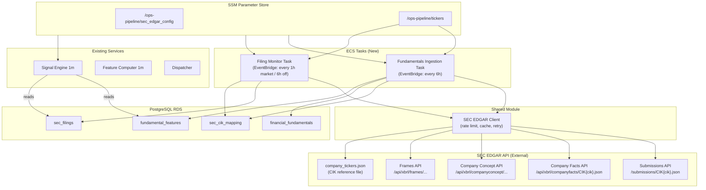
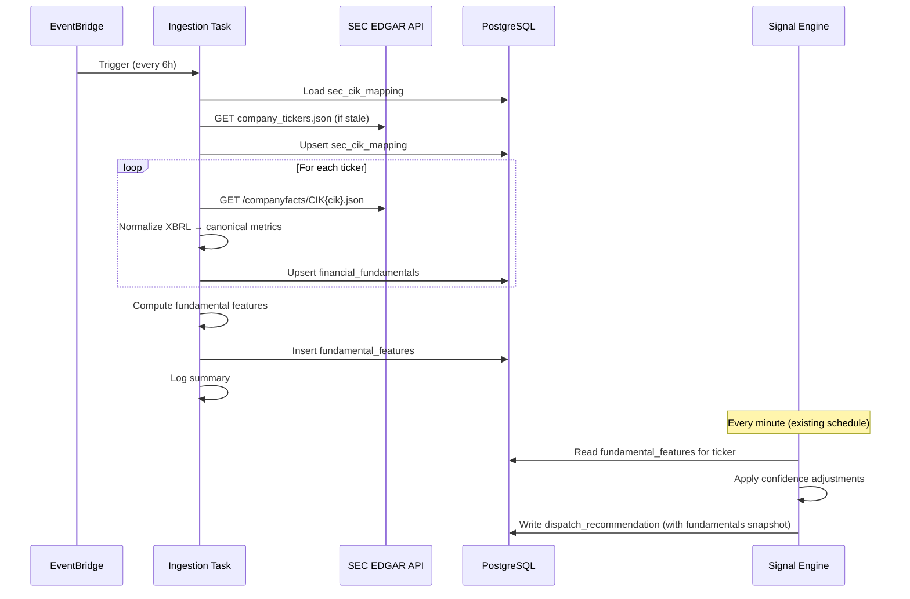

# Design Document: SEC EDGAR Fundamentals Pipeline

## Overview

This design adds a fundamentals data pipeline to the existing algorithmic options trading system. The pipeline ingests structured financial data from the SEC's free EDGAR XBRL API, normalizes it into canonical GAAP metrics, stores it in PostgreSQL, computes derived fundamental features (revenue growth, profit margin, leverage, cash flow trends), and feeds those features into the signal engine for confidence adjustments.

The pipeline consists of three new ECS tasks and one integration module:
1. **SEC EDGAR Client** — shared Python module for all SEC API interactions
2. **Fundamentals Ingestion Task** — scheduled ECS task that pulls and normalizes Company Facts
3. **Filing Monitor Task** — scheduled ECS task that detects new SEC filings (10-K, 10-Q, 8-K)
4. **Signal Engine Integration** — module within the signal engine that applies fundamental-based confidence adjustments

All configuration is SSM-driven (JSON in Parameter Store), following the existing `services/dispatcher/config.py` pattern. Database access follows the existing pattern: writes via direct connection from ECS tasks, reads via the `ops-pipeline-db-query` Lambda or direct connection.

## Architecture



### Data Flow



## Components and Interfaces

### 1. SEC EDGAR Client (`services/sec_edgar/client.py`) — NEW

Shared Python module used by both the Ingestion Task and Filing Monitor Task.

```python
import time
import threading
import requests
from typing import Optional, Dict, Any, List
from dataclasses import dataclass, field
from datetime import datetime, timedelta

@dataclass
class CacheEntry:
    data: Any
    expires_at: datetime

class SECEdgarClient:
    """
    Python client for SEC EDGAR API with rate limiting, caching, and retry.
    
    SEC requirements:
    - User-Agent header on every request (company name + admin email)
    - Max 10 requests/second
    """
    
    BASE_URL = "https://data.sec.gov"
    TICKER_URL = "https://www.sec.gov/files/company_tickers.json"
    
    def __init__(self, user_agent: str, cache_ttl_facts: int = 3600, cache_ttl_submissions: int = 300):
        self.user_agent = user_agent
        self.cache_ttl_facts = cache_ttl_facts
        self.cache_ttl_submissions = cache_ttl_submissions
        self._cache: Dict[str, CacheEntry] = {}
        self._rate_limiter = RateLimiter(max_per_second=10)
        self._session = requests.Session()
        self._session.headers.update({"User-Agent": user_agent, "Accept-Encoding": "gzip, deflate"})
    
    def get_submissions(self, cik: str) -> Optional[Dict]:
        """Fetch filing history for a company. Returns None on 404."""
        url = f"{self.BASE_URL}/submissions/CIK{cik.zfill(10)}.json"
        return self._get_cached(url, self.cache_ttl_submissions)
    
    def get_company_facts(self, cik: str) -> Optional[Dict]:
        """Fetch all XBRL facts for a company. Returns None on 404."""
        url = f"{self.BASE_URL}/api/xbrl/companyfacts/CIK{cik.zfill(10)}.json"
        return self._get_cached(url, self.cache_ttl_facts)
    
    def get_company_concept(self, cik: str, taxonomy: str, tag: str) -> Optional[Dict]:
        """Fetch a single concept across all periods. Returns None on 404."""
        url = f"{self.BASE_URL}/api/xbrl/companyconcept/CIK{cik.zfill(10)}/{taxonomy}/{tag}.json"
        return self._get_cached(url, self.cache_ttl_facts)
    
    def get_frames(self, taxonomy: str, tag: str, unit: str, period: str) -> Optional[Dict]:
        """Fetch a concept across all companies for a period. Returns None on 404."""
        url = f"{self.BASE_URL}/api/xbrl/frames/{taxonomy}/{tag}/{unit}/{period}.json"
        return self._get_cached(url, self.cache_ttl_facts)
    
    def load_ticker_cik_map(self) -> Dict[str, str]:
        """Load SEC's published ticker→CIK reference file. Returns {ticker: cik}."""
        data = self._get_cached(self.TICKER_URL, ttl=86400)  # Cache 24h
        if not data:
            return {}
        result = {}
        for entry in data.values():
            ticker = entry.get("ticker", "").upper()
            cik = str(entry.get("cik_str", ""))
            if ticker and cik:
                result[ticker] = cik.zfill(10)
        return result
    
    def _get_cached(self, url: str, ttl: int) -> Optional[Any]:
        """Fetch with cache and rate limiting."""
        now = datetime.utcnow()
        if url in self._cache and self._cache[url].expires_at > now:
            return self._cache[url].data
        
        data = self._request_with_retry(url)
        if data is not None:
            self._cache[url] = CacheEntry(data=data, expires_at=now + timedelta(seconds=ttl))
        return data
    
    def _request_with_retry(self, url: str, max_retries: int = 3) -> Optional[Any]:
        """HTTP GET with rate limiting, 429 handling, and exponential backoff for 5xx."""
        for attempt in range(max_retries + 1):
            self._rate_limiter.acquire()
            try:
                resp = self._session.get(url, timeout=30)
                if resp.status_code == 200:
                    return resp.json()
                if resp.status_code == 404:
                    return None
                if resp.status_code == 429:
                    wait = int(resp.headers.get("Retry-After", 10))
                    time.sleep(wait)
                    continue
                if 500 <= resp.status_code < 600:
                    if attempt < max_retries:
                        time.sleep(2 ** attempt)
                        continue
                    return None
                # Other errors
                return None
            except requests.RequestException:
                if attempt < max_retries:
                    time.sleep(2 ** attempt)
                    continue
                return None
        return None


class RateLimiter:
    """Token bucket rate limiter — max N requests per second."""
    
    def __init__(self, max_per_second: int = 10):
        self.max_per_second = max_per_second
        self._lock = threading.Lock()
        self._timestamps: List[float] = []
    
    def acquire(self):
        """Block until a request slot is available."""
        with self._lock:
            now = time.monotonic()
            # Remove timestamps older than 1 second
            self._timestamps = [t for t in self._timestamps if now - t < 1.0]
            if len(self._timestamps) >= self.max_per_second:
                sleep_time = 1.0 - (now - self._timestamps[0])
                if sleep_time > 0:
                    time.sleep(sleep_time)
            self._timestamps.append(time.monotonic())
```

### 2. GAAP Concept Mapping (`services/sec_edgar/gaap_mapping.py`) — NEW

```python
"""
Maps XBRL concept tags to canonical metric names.
Priority order: first match wins when multiple tags exist for the same metric.
"""

GAAP_CONCEPT_MAP: Dict[str, List[str]] = {
    "revenue": [
        "us-gaap:Revenues",
        "us-gaap:RevenueFromContractWithCustomerExcludingAssessedTax",
        "us-gaap:RevenueFromContractWithCustomerIncludingAssessedTax",
        "us-gaap:SalesRevenueNet",
        "us-gaap:SalesRevenueGoodsNet",
        "us-gaap:SalesRevenueServicesNet",
    ],
    "net_income": [
        "us-gaap:NetIncomeLoss",
        "us-gaap:ProfitLoss",
        "us-gaap:NetIncomeLossAvailableToCommonStockholdersBasic",
    ],
    "total_assets": [
        "us-gaap:Assets",
    ],
    "total_liabilities": [
        "us-gaap:Liabilities",
        "us-gaap:LiabilitiesAndStockholdersEquity",
    ],
    "stockholders_equity": [
        "us-gaap:StockholdersEquity",
        "us-gaap:StockholdersEquityIncludingPortionAttributableToNoncontrollingInterest",
    ],
    "operating_cash_flow": [
        "us-gaap:NetCashProvidedByUsedInOperatingActivities",
        "us-gaap:NetCashProvidedByUsedInOperatingActivitiesContinuingOperations",
    ],
    "total_debt": [
        "us-gaap:LongTermDebt",
        "us-gaap:LongTermDebtAndCapitalLeaseObligations",
        "us-gaap:DebtInstrumentCarryingAmount",
        "us-gaap:LongTermDebtNoncurrent",
    ],
    "earnings_per_share": [
        "us-gaap:EarningsPerShareBasic",
        "us-gaap:EarningsPerShareDiluted",
    ],
    "operating_income": [
        "us-gaap:OperatingIncomeLoss",
    ],
}

# Reverse lookup: XBRL tag → canonical name (first match priority)
TAG_TO_CANONICAL: Dict[str, str] = {}
for canonical, tags in GAAP_CONCEPT_MAP.items():
    for tag in tags:
        if tag not in TAG_TO_CANONICAL:
            TAG_TO_CANONICAL[tag] = canonical

def normalize_metric_name(xbrl_tag: str, taxonomy: str = "us-gaap") -> str:
    """
    Convert an XBRL tag to its canonical metric name.
    Returns 'raw:{taxonomy}:{tag}' if not in the mapping.
    """
    full_tag = f"{taxonomy}:{xbrl_tag}" if ":" not in xbrl_tag else xbrl_tag
    return TAG_TO_CANONICAL.get(full_tag, f"raw:{full_tag}")
```

### 3. Fundamentals Ingestion Task (`services/sec_edgar_ingest/main.py`) — NEW

Follows the existing ECS task pattern (like `services/vix_monitor/main.py`).

```python
def main():
    """Main ingestion loop."""
    config = load_config()  # SSM + Secrets Manager (same pattern as dispatcher)
    sec_config = load_sec_edgar_config(config)
    
    if not sec_config.get("user_agent_string"):
        log_event("critical", {"error": "user_agent_string missing from SSM — refusing to call SEC API"})
        sys.exit(1)
    
    client = SECEdgarClient(user_agent=sec_config["user_agent_string"])
    conn = get_db_connection(config)
    
    # Step 1: Refresh ticker→CIK mapping (max once/day)
    refresh_cik_mapping(client, conn)
    
    # Step 2: Load CIK mappings
    cik_map = load_cik_mappings(conn)
    
    # Step 3: Ingest company facts for each ticker
    stats = {"processed": 0, "inserted": 0, "updated": 0, "skipped": 0, "errors": 0}
    monitored_metrics = sec_config.get("monitored_metrics", DEFAULT_METRICS)
    
    for ticker, cik in cik_map.items():
        try:
            facts = client.get_company_facts(cik)
            if not facts:
                stats["errors"] += 1
                continue
            normalize_and_store(conn, ticker, cik, facts, monitored_metrics, stats)
            stats["processed"] += 1
        except Exception as e:
            log_event("ticker_error", {"ticker": ticker, "error": str(e)})
            stats["errors"] += 1
    
    # Step 4: Compute fundamental features
    compute_all_features(conn, list(cik_map.keys()))
    
    log_event("ingestion_complete", stats)
    conn.close()
```

### 4. Fundamental Feature Computer (`services/sec_edgar/features.py`) — NEW

```python
def compute_fundamental_features(conn, ticker: str) -> List[Dict]:
    """
    Compute derived features from financial_fundamentals for a single ticker.
    Returns list of {feature_name, feature_value} dicts.
    """
    features = []
    
    # Revenue growth YoY
    yoy = compute_growth_rate(conn, ticker, "revenue", "annual", periods_back=2)
    if yoy is not None:
        features.append({"feature_name": "revenue_growth_yoy", "feature_value": yoy})
    
    # Revenue growth QoQ
    qoq = compute_growth_rate(conn, ticker, "revenue", "quarterly", periods_back=2)
    if qoq is not None:
        features.append({"feature_name": "revenue_growth_qoq", "feature_value": qoq})
    
    # Profit margin
    margin = compute_ratio(conn, ticker, "net_income", "revenue", "quarterly")
    if margin is not None:
        features.append({"feature_name": "profit_margin", "feature_value": margin * 100})
    
    # Leverage ratio (debt / equity)
    leverage = compute_ratio(conn, ticker, "total_debt", "stockholders_equity", "quarterly")
    if leverage is not None:
        features.append({"feature_name": "leverage_ratio", "feature_value": leverage})
    
    # Operating cash flow trend (sign of change over last 2 quarters)
    ocf_trend = compute_trend_sign(conn, ticker, "operating_cash_flow", "quarterly", periods_back=2)
    if ocf_trend is not None:
        features.append({"feature_name": "operating_cash_flow_trend", "feature_value": ocf_trend})
    
    # Asset turnover (revenue / total_assets)
    turnover = compute_ratio(conn, ticker, "revenue", "total_assets", "annual")
    if turnover is not None:
        features.append({"feature_name": "asset_turnover", "feature_value": turnover})
    
    return features


def compute_growth_rate(conn, ticker: str, metric: str, period_type: str, periods_back: int = 2) -> Optional[float]:
    """
    Compute percentage change between the two most recent periods.
    Returns (current - prior) / abs(prior) * 100, or None if insufficient data.
    Returns None if prior period value is zero.
    """
    rows = query_recent_metrics(conn, ticker, metric, period_type, limit=periods_back)
    if len(rows) < 2:
        return None
    current, prior = rows[0]["metric_value"], rows[1]["metric_value"]
    if prior == 0:
        return None
    return (current - prior) / abs(prior) * 100


def compute_ratio(conn, ticker: str, numerator_metric: str, denominator_metric: str, period_type: str) -> Optional[float]:
    """Compute ratio of two metrics from the most recent period."""
    num = query_latest_metric(conn, ticker, numerator_metric, period_type)
    den = query_latest_metric(conn, ticker, denominator_metric, period_type)
    if num is None or den is None or den == 0:
        return None
    return num / den


def compute_trend_sign(conn, ticker: str, metric: str, period_type: str, periods_back: int = 2) -> Optional[float]:
    """
    Return +1 if metric is increasing, -1 if decreasing, 0 if flat.
    Based on the two most recent periods.
    """
    rows = query_recent_metrics(conn, ticker, metric, period_type, limit=periods_back)
    if len(rows) < 2:
        return None
    diff = rows[0]["metric_value"] - rows[1]["metric_value"]
    if diff > 0:
        return 1.0
    elif diff < 0:
        return -1.0
    return 0.0
```

### 5. Filing Monitor Task (`services/sec_edgar_filing_monitor/main.py`) — NEW

```python
def main():
    """Check for new SEC filings across all monitored tickers."""
    config = load_config()
    sec_config = load_sec_edgar_config(config)
    
    if not sec_config.get("user_agent_string"):
        log_event("critical", {"error": "user_agent_string missing"})
        sys.exit(1)
    
    client = SECEdgarClient(user_agent=sec_config["user_agent_string"])
    conn = get_db_connection(config)
    cik_map = load_cik_mappings(conn)
    
    stats = {"checked": 0, "new_10k": 0, "new_10q": 0, "new_8k": 0, "errors": 0}
    
    for ticker, cik in cik_map.items():
        try:
            submissions = client.get_submissions(cik)
            if not submissions:
                stats["errors"] += 1
                continue
            
            latest_filing_date = get_latest_filing_date(conn, ticker)
            new_filings = extract_new_filings(submissions, ticker, cik, latest_filing_date)
            
            for filing in new_filings:
                insert_filing(conn, filing)
                form = filing["form_type"]
                if form in ("10-K", "10-K/A"):
                    stats["new_10k"] += 1
                elif form in ("10-Q", "10-Q/A"):
                    stats["new_10q"] += 1
                elif form.startswith("8-K"):
                    stats["new_8k"] += 1
            
            stats["checked"] += 1
        except Exception as e:
            log_event("filing_check_error", {"ticker": ticker, "error": str(e)})
            stats["errors"] += 1
    
    log_event("filing_monitor_complete", stats)
    conn.close()
```

### 6. Signal Engine Integration (`services/signal_engine_1m/fundamentals.py`) — NEW

Plugs into the existing `compute_signal()` flow in `rules.py` as a post-processing confidence multiplier.

```python
def get_fundamental_adjustments(conn, ticker: str, signal_direction: str, config: Dict) -> Dict:
    """
    Query fundamental features and compute confidence adjustments.
    
    Returns:
        {
            "multiplier": float,  # Combined confidence multiplier (default 1.0)
            "risk_off": bool,     # True if risk-off signal detected
            "adjustments": [...], # List of applied adjustments for logging
            "features_snapshot": {...}  # For learning pipeline
        }
    """
    features = query_fundamental_features(conn, ticker)
    if not features:
        return {"multiplier": 1.0, "risk_off": False, "adjustments": [], "features_snapshot": None}
    
    rules = config.get("confidence_boost_rules", DEFAULT_RULES)
    multiplier = 1.0
    adjustments = []
    risk_off = False
    
    rev_growth = features.get("revenue_growth_yoy")
    ocf_trend = features.get("operating_cash_flow_trend")
    profit_margin = features.get("profit_margin")
    
    # Rule 1: Revenue growth boost for bullish signals
    if rev_growth is not None and rev_growth > 10.0 and signal_direction in ("BUY_CALL", "BUY_STOCK"):
        boost = rules.get("revenue_growth_boost", 1.10)
        multiplier *= boost
        adjustments.append({"rule": "revenue_growth_boost", "value": rev_growth, "multiplier": boost})
    
    # Rule 2: Negative cash flow penalty
    if ocf_trend is not None and ocf_trend < 0:
        penalty = rules.get("negative_cashflow_penalty", 0.85)
        multiplier *= penalty
        adjustments.append({"rule": "negative_cashflow_penalty", "value": ocf_trend, "multiplier": penalty})
    
    # Rule 3: Risk-off signal (declining revenue + declining margin)
    rev_qoq = features.get("revenue_growth_qoq")
    if rev_growth is not None and rev_growth < 0 and profit_margin is not None:
        # Check if margin is declining (need prior margin — use QoQ revenue as proxy for trend)
        if rev_qoq is not None and rev_qoq < 0:
            risk_off = True
            adjustments.append({"rule": "risk_off", "revenue_yoy": rev_growth, "revenue_qoq": rev_qoq})
    
    return {
        "multiplier": multiplier,
        "risk_off": risk_off,
        "adjustments": adjustments,
        "features_snapshot": features,
    }
```

### 7. SSM Config Loader (`services/sec_edgar/config.py`) — NEW

```python
DEFAULT_METRICS = [
    "revenue", "net_income", "total_assets", "total_liabilities",
    "stockholders_equity", "operating_cash_flow", "total_debt",
    "earnings_per_share", "operating_income"
]

DEFAULT_CONFIDENCE_RULES = {
    "revenue_growth_boost": 1.10,
    "negative_cashflow_penalty": 0.85,
}

def load_sec_edgar_config(base_config: Dict) -> Dict:
    """
    Load SEC EDGAR config from SSM /ops-pipeline/sec_edgar_config.
    Falls back to defaults for missing/invalid fields (except user_agent_string).
    """
    ssm = boto3.client("ssm", region_name=base_config.get("region", "us-west-2"))
    try:
        param = ssm.get_parameter(Name="/ops-pipeline/sec_edgar_config")
        raw = param["Parameter"]["Value"]
        config = json.loads(raw)
    except ssm.exceptions.ParameterNotFound:
        log_event("warning", {"msg": "SSM /ops-pipeline/sec_edgar_config not found, using defaults"})
        config = {}
    except json.JSONDecodeError:
        log_event("error", {"msg": "SSM sec_edgar_config is not valid JSON, using defaults"})
        config = {}
    
    return {
        "user_agent_string": config.get("user_agent_string"),  # Required — no default
        "refresh_interval_hours": config.get("refresh_interval_hours", 6),
        "monitored_metrics": config.get("monitored_metrics", DEFAULT_METRICS),
        "confidence_boost_rules": config.get("confidence_boost_rules", DEFAULT_CONFIDENCE_RULES),
        "filing_check_interval_hours_market": config.get("filing_check_interval_hours_market", 1),
        "filing_check_interval_hours_off": config.get("filing_check_interval_hours_off", 6),
    }


def serialize_sec_edgar_config(config: Dict) -> str:
    """Serialize config to JSON string for SSM storage."""
    return json.dumps(config, indent=2, sort_keys=True)


def deserialize_sec_edgar_config(raw: str) -> Dict:
    """Deserialize config from JSON string."""
    return json.loads(raw)
```

## Data Models

### Database Tables

#### `sec_cik_mapping`

| Column | Type | Constraints | Description |
|--------|------|-------------|-------------|
| ticker | VARCHAR(10) | PRIMARY KEY | Stock ticker symbol |
| cik | VARCHAR(10) | NOT NULL | SEC CIK (zero-padded) |
| company_name | VARCHAR(255) | | Company legal name |
| last_updated | TIMESTAMPTZ | NOT NULL, DEFAULT now() | Last refresh timestamp |

#### `financial_fundamentals`

| Column | Type | Constraints | Description |
|--------|------|-------------|-------------|
| id | SERIAL | PRIMARY KEY | Auto-increment ID |
| ticker | VARCHAR(10) | NOT NULL | Stock ticker |
| cik | VARCHAR(10) | NOT NULL | SEC CIK |
| report_date | DATE | NOT NULL | End date of reporting period |
| metric_name | VARCHAR(100) | NOT NULL | Canonical metric name or raw:tag |
| metric_value | NUMERIC | | Financial value |
| period_type | VARCHAR(20) | NOT NULL | quarterly, annual, or ytd |
| filing_date | DATE | | Date the filing was submitted |
| taxonomy | VARCHAR(50) | DEFAULT 'us-gaap' | XBRL taxonomy |
| created_at | TIMESTAMPTZ | DEFAULT now() | Record creation time |

Unique constraint: `(ticker, metric_name, report_date, period_type)`

Indexes: `(ticker, metric_name)`, `(ticker, report_date)`

#### `fundamental_features`

| Column | Type | Constraints | Description |
|--------|------|-------------|-------------|
| id | SERIAL | PRIMARY KEY | Auto-increment ID |
| ticker | VARCHAR(10) | NOT NULL | Stock ticker |
| computed_at | TIMESTAMPTZ | NOT NULL | Computation timestamp |
| feature_name | VARCHAR(100) | NOT NULL | Feature identifier |
| feature_value | NUMERIC | | Computed value |

Index: `(ticker, feature_name)`

#### `sec_filings`

| Column | Type | Constraints | Description |
|--------|------|-------------|-------------|
| id | SERIAL | PRIMARY KEY | Auto-increment ID |
| ticker | VARCHAR(10) | NOT NULL | Stock ticker |
| cik | VARCHAR(10) | NOT NULL | SEC CIK |
| form_type | VARCHAR(20) | NOT NULL | 10-K, 10-Q, 8-K, etc. |
| accession_number | VARCHAR(30) | NOT NULL, UNIQUE | SEC accession number |
| filing_date | DATE | NOT NULL | Filing submission date |
| primary_doc_url | VARCHAR(500) | | URL to primary document |
| processed | BOOLEAN | DEFAULT false | Whether pipeline has processed |
| created_at | TIMESTAMPTZ | DEFAULT now() | Record creation time |

Indexes: `(ticker, form_type)`, `(filing_date)`

### SSM Config Schema

`/ops-pipeline/sec_edgar_config`:

```json
{
  "user_agent_string": "OpsTrading admin@example.com",
  "refresh_interval_hours": 6,
  "monitored_metrics": [
    "revenue", "net_income", "total_assets", "total_liabilities",
    "stockholders_equity", "operating_cash_flow", "total_debt",
    "earnings_per_share", "operating_income"
  ],
  "confidence_boost_rules": {
    "revenue_growth_boost": 1.10,
    "negative_cashflow_penalty": 0.85
  },
  "filing_check_interval_hours_market": 1,
  "filing_check_interval_hours_off": 6
}
```


## Correctness Properties

*A property is a characteristic or behavior that should hold true across all valid executions of a system — essentially, a formal statement about what the system should do. Properties serve as the bridge between human-readable specifications and machine-verifiable correctness guarantees.*

### Property 1: Ticker-to-CIK resolution produces valid zero-padded CIKs

*For any* set of monitored tickers and a SEC reference file containing those tickers, resolving the tickers SHALL produce CIK strings that are exactly 10 characters long, consist only of digits, and match the CIK in the reference file.

**Validates: Requirements 1.1, 1.2**

### Property 2: Cache hit returns data without HTTP request

*For any* URL and response data, after a successful fetch that populates the cache, a subsequent request to the same URL within the TTL SHALL return the same data without making an HTTP request.

**Validates: Requirements 2.5, 2.6**

### Property 3: Rate limiter enforces 10 requests per second

*For any* sequence of N requests (N > 10) issued as fast as possible, the elapsed wall-clock time SHALL be at least `(N - 10) / 10` seconds, ensuring no more than 10 requests are dispatched per second.

**Validates: Requirements 2.2**

### Property 4: GAAP concept normalization maps known tags and prefixes unknown tags

*For any* XBRL tag that exists in the GAAP concept mapping, `normalize_metric_name` SHALL return the corresponding canonical metric name. *For any* XBRL tag not in the mapping, `normalize_metric_name` SHALL return a string prefixed with `raw:`. When multiple tags for the same canonical metric appear in a single filing period, the tag with the lowest index in the priority list SHALL be selected.

**Validates: Requirements 4.1, 4.3, 4.5**

### Property 5: XBRL fact extraction filters by monitored metrics

*For any* Company Facts response containing facts across multiple XBRL concepts, and a configured list of monitored metrics, the normalization step SHALL produce rows only for facts whose canonical metric name (after GAAP mapping) is in the monitored metrics list or whose tag is unmapped (raw: prefix).

**Validates: Requirements 3.2, 3.3**

### Property 6: Financial fundamentals upsert only updates when filing date is newer

*For any* existing record in `financial_fundamentals` with key (ticker, metric_name, report_date, period_type) and a new fact with the same key, the record SHALL be updated if and only if the new fact's filing_date is strictly more recent than the existing filing_date. The metric_value and filing_date SHALL reflect the most recently filed data.

**Validates: Requirements 3.4**

### Property 7: Growth rate formula correctness

*For any* two non-zero numeric values `current` and `prior`, `compute_growth_rate` SHALL return `(current - prior) / abs(prior) * 100`. When `prior` is zero, the function SHALL return None.

**Validates: Requirements 5.5, 5.6**

### Property 8: Feature computation produces all features when data is complete

*For any* ticker with at least 2 quarterly and 2 annual periods of data for all required metrics (revenue, net_income, total_assets, total_liabilities, stockholders_equity, operating_cash_flow, total_debt), `compute_fundamental_features` SHALL produce exactly 6 features: revenue_growth_yoy, revenue_growth_qoq, profit_margin, leverage_ratio, operating_cash_flow_trend, asset_turnover.

**Validates: Requirements 5.1**

### Property 9: Confidence adjustment rules apply correct multipliers

*For any* set of fundamental features and a bullish signal direction: if `revenue_growth_yoy > 10`, the multiplier includes `revenue_growth_boost`; if `operating_cash_flow_trend < 0`, the multiplier includes `negative_cashflow_penalty`; if both `revenue_growth_yoy < 0` and `revenue_growth_qoq < 0`, the `risk_off` flag is set to true. When features are empty, the multiplier SHALL be 1.0 and risk_off SHALL be false.

**Validates: Requirements 6.3, 6.4, 6.5, 6.6**

### Property 10: New filing detection finds only filings newer than the latest stored

*For any* set of submissions for a ticker and an existing latest filing date in `sec_filings`, `extract_new_filings` SHALL return only filings with a filing_date strictly after the latest stored date. When no filings exist in the database, all filings from submissions SHALL be returned.

**Validates: Requirements 7.2, 7.3**

### Property 11: SSM config round-trip

*For any* valid SEC EDGAR config dictionary, serializing to JSON then deserializing back SHALL produce a dictionary with identical keys and values.

**Validates: Requirements 9.5**

### Property 12: CIK mapping upsert preserves existing CIK

*For any* existing CIK mapping (ticker, cik, company_name) and an update with the same ticker but potentially different company_name, the upsert SHALL preserve the original CIK value and update only the company_name and last_updated fields.

**Validates: Requirements 1.4**

## Error Handling

### API Errors

| Error Condition | Handling | Requirement |
|---|---|---|
| SEC API returns 404 | Return None, log warning | R2.8 |
| SEC API returns 429 | Wait Retry-After (or 10s), retry | R2.3 |
| SEC API returns 5xx | Retry up to 3x with exponential backoff | R2.4 |
| SEC API unreachable (timeout/connection error) | Retry up to 3x, then skip ticker | R3.6, R7.7 |
| Ticker not found in SEC reference file | Log warning, skip ticker | R1.3 |

### Configuration Errors

| Error Condition | Handling | Requirement |
|---|---|---|
| SSM parameter missing | Use defaults for all fields except user_agent_string | R9.3 |
| SSM parameter invalid JSON | Use defaults, log error | R9.3 |
| user_agent_string missing | Refuse all API requests, log critical error | R9.4 |

### Data Errors

| Error Condition | Handling | Requirement |
|---|---|---|
| XBRL tag not in GAAP mapping | Store with `raw:` prefix | R4.3 |
| Missing metric for feature computation | Skip that feature, log warning | R5.2 |
| Division by zero in growth rate | Return None, log warning | R5.6 |
| No fundamental features for ticker | Apply no confidence adjustment (multiplier = 1.0) | R6.6 |
| Duplicate financial fact (same key) | Upsert: update only if newer filing_date | R3.4 |

### General Error Strategy

- All errors are logged as structured JSON events (same pattern as existing services)
- Ticker-level errors never halt the entire ingestion run — skip and continue
- Conservative fallbacks: missing data means no adjustment (multiplier = 1.0), not a crash
- The `user_agent_string` is the only hard requirement — without it, the SEC will block requests

## Testing Strategy

### Property-Based Testing

Use `hypothesis` (Python) as the property-based testing library. Each property test runs a minimum of 100 iterations.

Property tests validate universal correctness properties across randomly generated inputs. Each test references a specific design property and the requirements it validates.

Tag format: `# Feature: sec-edgar-fundamentals, Property {N}: {title}`

### Unit Testing

Use `pytest` for unit tests. Unit tests complement property tests by covering:

- Specific examples with known expected outputs (e.g., known AAPL CIK = 0000320193)
- Edge cases (zero-padded CIKs, empty company facts, malformed XBRL)
- Integration points (SSM loading, database queries, HTTP mocking)
- Error conditions (API failures, missing fields, invalid JSON)

### Test Organization

```
tests/
├── test_sec_edgar_client.py       # Property + unit tests for SECEdgarClient (cache, rate limit, retry)
├── test_gaap_mapping.py           # Property + unit tests for GAAP concept normalization
├── test_fundamentals_ingest.py    # Property + unit tests for ingestion and upsert logic
├── test_fundamental_features.py   # Property + unit tests for feature computation (growth rate, ratios)
├── test_signal_integration.py     # Property + unit tests for confidence adjustment rules
├── test_filing_monitor.py         # Property + unit tests for new filing detection
├── test_sec_config.py             # Property + unit tests for SSM config round-trip and defaults
```

### Key Testing Patterns

- **Round-trip**: SSM config serialize/deserialize (Property 11)
- **Invariant**: CIK always 10 digits (Property 1), rate limiter timing (Property 3)
- **Metamorphic**: Adding more filings to submissions only increases or maintains the count of detected new filings (Property 10)
- **Idempotent**: Upsert with same filing_date produces no change (Property 6)
- **Error conditions**: Missing user_agent blocks all requests, missing metrics skip features
